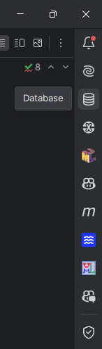
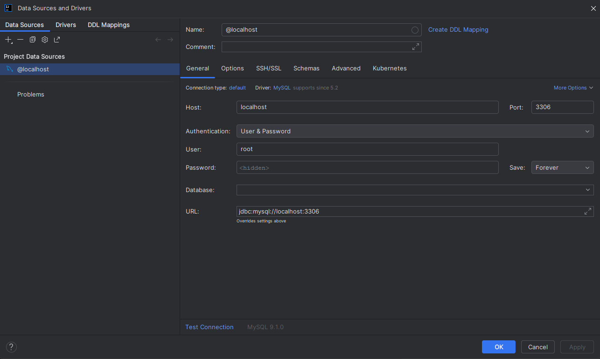
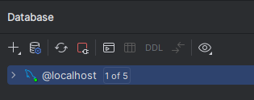
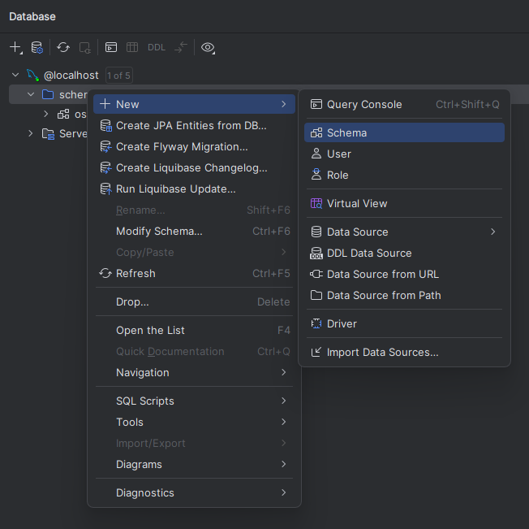
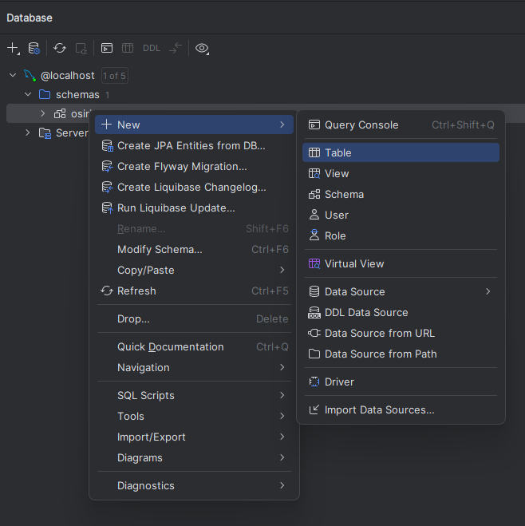

# OSIRIS: Plaid Banking App

## Author: 
### Mahan Hooshmandkhayat:
###### Welcome View for Team Use Case, Add Bank Account Use Case, MySQL Database Integration, Spring Boot Server Integration, Frontend Integration Using JavaScript and Html
### Divnoor Pal Singh Chatha:
###### Verify View for Team Use Case, GrabTransaction UseCase, ViewExpenses UseCase, JFreeChart Integration
### Shah Jalalul Kabir:
###### CAPTCHA Signup Verification System for Team Use Case, Generate Assets Report UseCase
### Christopher Han Roy:
##### Dashboard view for Team Use Case, Buget for personal use case

## Preamble

The project gets financial information from any bank account in Canada or USA for specific user, and analyzes the
data for it to be displayed onto various pages for your viewing pleasure.

This project is intriguing because it provides a seamless way to access and analyze financial data from any Canadian or 
U.S. bank account, offering personalized insights in an engaging and user-friendly format. By simplifying complex 
financial information and presenting it visually across multiple pages, it empowers users to make informed decisions with ease.

This project solves the problem of fragmented financial management by consolidating data from various bank accounts into 
one accessible platform. It eliminates the need for manual tracking and analysis of financial information, saving users 
time and reducing errors. Additionally, it provides clear, actionable insights, helping users better understand and manage their finances.


## Features of the software
Uses the program uses OkHttp to allow a user to make an OSIRIS account using a username and password along with a 
verfication system, which done by the Brevo API. All the servers are made using the Spring Boot API. Once the user is 
logged in, the user can add a bank account using the bank account button on the home page. This is where the Plaid API 
is called and allows you to add a bank account. Once Bank account is added, the user can navigate to the various pages 
in the homepage to view various analysis regarding thier bank account. Features like looking at a graph of your 
Non-Essential vs Essential spending over the last 30 days or viewing your spending habits broken down into how much 
money you spend each month.

## Installation Instructions
You should currently be viewing this README in the GitHub repository: https://github.com/Mahan-H/CSC207_Project.
Ensure you're logged into GitHub. 

In the top-right corner of the page, you'll see a Fork button. Click it to create your 
own copy of the repository, which you can modify as needed. On the next page, confirm the fork creation. This will 
generate your own version of the OSIRIS repository on GitHub. Once you’ve created your fork, close this page, navigate 
to your forked repository, and follow the subsequent instructions. 

Next, you’ll need a local copy of your forked repository on your computer. This process is called cloning the 
repository. In your forked repository on GitHub, click the green Code button and copy the HTTPS URL by clicking the 
small copy icon (two overlapping rectangles). 

Open IntelliJ. If you have a project already open, close it. From the main screen, select Get From VCS. Paste the copied
URL into the appropriate field. You can use the default location on your computer to save the project or choose a custom 
directory. 

Note: If you clone the repository again later, you’ll need to select a new directory, as duplicate projects 
cannot exist in the same directory. Click Clone and IntelliJ will set up your project. If prompted, you may need to 
configure an access token to clone the repository, especially if this was not completed during the initial software 
setup on Quercus. 

With the repository cloned to your computer, proceed to work through the rest of the activity in 
IntelliJ. Open this README.md file in IntelliJ, and toggle between the editor, editor+preview, or preview view using 
the options in the top-right corner. You can take notes directly in the file or simply review it in the preview view. 

Make sure you load the maven project and make sure that the pom.xml file is the following:

```    
<?xml version="1.0" encoding="UTF-8"?>
<project xmlns="http://maven.apache.org/POM/4.0.0"
         xmlns:xsi="http://www.w3.org/2001/XMLSchema-instance"
         xsi:schemaLocation="http://maven.apache.org/POM/4.0.0 http://maven.apache.org/xsd/maven-4.0.0.xsd">
    <modelVersion>4.0.0</modelVersion>

    <groupId>com.example</groupId>
    <artifactId>plaid-integration</artifactId>
    <version>1.0.0</version>
    <packaging>jar</packaging>

    <name>plaid-integration</name>
    <description>Integration of Plaid API with Spring Boot</description>

    <properties>
        <java.version>17</java.version>
        <spring.boot.version>3.4.0</spring.boot.version>
        <gson.version>2.11.0</gson.version>
        <maven.compiler.source>11</maven.compiler.source>
        <maven.compiler.target>11</maven.compiler.target>
        <project.build.sourceEncoding>UTF-8</project.build.sourceEncoding>
    </properties>

    <parent>
        <groupId>org.springframework.boot</groupId>
        <artifactId>spring-boot-starter-parent</artifactId>
        <version>3.4.0</version>
        <relativePath/>
    </parent>

    <repositories>
        <repository>
            <id>plaid-repo</id>
            <url>https://plaid.com/maven</url>
        </repository>
    </repositories>

    <dependencies>
        <dependency>
            <groupId>org.mockito</groupId>
            <artifactId>mockito-core</artifactId>
            <version>5.0.0</version>
            <scope>test</scope>
        </dependency>
        <dependency>
            <groupId>org.jfree</groupId>
            <artifactId>jfreechart</artifactId>
            <version>1.5.3</version>
        </dependency>
        <dependency>
            <groupId>org.junit.jupiter</groupId>
            <artifactId>junit-jupiter</artifactId>
            <version>5.8.1</version>
            <scope>test</scope>
        </dependency>
        <dependency>
            <groupId>com.plaid</groupId>
            <artifactId>plaid-java</artifactId>
            <version>29.0.0</version> <!-- You can use the latest stable version -->
        </dependency>
        <dependency>
            <groupId>org.apache.httpcomponents</groupId>
            <artifactId>httpclient</artifactId>
            <version>4.5.13</version>
        </dependency>
        <dependency>
            <groupId>org.json</groupId>
            <artifactId>json</artifactId>
            <version>20240303</version>
        </dependency>
        <dependency>
            <groupId>com.squareup.okhttp3</groupId>
            <artifactId>okhttp</artifactId>
            <version>4.12.0</version>
        </dependency>
        <dependency>
            <groupId>junit</groupId>
            <artifactId>junit</artifactId>
            <version>4.13.1</version>
            <scope>test</scope>
        </dependency>
        <dependency>
            <groupId>org.junit.jupiter</groupId>
            <artifactId>junit-jupiter</artifactId>
            <version>5.8.1</version>
            <scope>test</scope>
        </dependency>
        <dependency>
            <groupId>com.sendinblue</groupId>
            <artifactId>sib-api-v3-sdk</artifactId>
            <version>7.0.0</version>
        </dependency>
        <dependency>
            <groupId>com.fasterxml.jackson.core</groupId>
            <artifactId>jackson-databind</artifactId>
            <version>2.18.1</version>
        </dependency>
        <dependency>
            <groupId>org.slf4j</groupId>
            <artifactId>slf4j-simple</artifactId>
            <version>1.7.32</version>
        </dependency>
        <dependency>
            <groupId>com.sun.mail</groupId>
            <artifactId>javax.mail</artifactId>
            <version>1.6.2</version>
        </dependency>
        <dependency>
            <groupId>org.springframework.boot</groupId>
            <artifactId>spring-boot-starter-web</artifactId>
        </dependency>

        <!-- Spring Data JPA -->
        <dependency>
            <groupId>org.springframework.boot</groupId>
            <artifactId>spring-boot-starter-data-jpa</artifactId>
        </dependency>

        <!-- Gson: JSON parser -->
        <dependency>
            <groupId>com.google.code.gson</groupId>
            <artifactId>gson</artifactId>
            <version>${gson.version}</version>
        </dependency>

        <!-- Spring Boot DevTools -->
        <dependency>
            <groupId>org.springframework.boot</groupId>
            <artifactId>spring-boot-devtools</artifactId>
            <scope>runtime</scope>
        </dependency>

        <!-- Spring Boot Starter Test (Optional for Testing) -->
        <dependency>
            <groupId>org.springframework.boot</groupId>
            <artifactId>spring-boot-starter-test</artifactId>
            <scope>test</scope>
        </dependency>
        <dependency>
            <groupId>com.h2database</groupId>
            <artifactId>h2</artifactId>
        </dependency>
        <dependency>
            <groupId>org.projectlombok</groupId>
            <artifactId>lombok</artifactId>
            <scope>annotationProcessor</scope>
        </dependency>
        <dependency>
            <groupId>org.mockito</groupId>
            <artifactId>mockito-core</artifactId>
            <version>5.14.2</version>
            <scope>test</scope>
        </dependency>
        <dependency>
            <groupId>org.mockito</groupId>
            <artifactId>mockito-junit-jupiter</artifactId>
            <version>5.14.2</version>
            <scope>test</scope>
        </dependency>
        <!-- https://mvnrepository.com/artifact/org.jacoco/jacoco-maven-plugin -->
        <dependency>
            <groupId>org.jacoco</groupId>
            <artifactId>jacoco-maven-plugin</artifactId>
            <version>0.8.12</version>
        </dependency>

    </dependencies>

    <build>
        <plugins>
            <plugin>
                <groupId>org.apache.maven.plugins</groupId>
                <artifactId>maven-compiler-plugin</artifactId>
                <version>3.11.0</version>
                <configuration>
                    <source>${java.version}</source>
                    <target>${java.version}</target>
                    <encoding>UTF-8</encoding>
                </configuration>
            </plugin>
            <plugin>
                <groupId>org.springframework.boot</groupId>
                <artifactId>spring-boot-maven-plugin</artifactId>
                <version>${spring.boot.version}</version>
            </plugin>
            <plugin>
                <groupId>org.apache.maven.plugins</groupId>
                <artifactId>maven-surefire-plugin</artifactId>
                <version>3.5.2</version>
            </plugin>
            <plugin>
                <groupId>org.jacoco</groupId>
                <artifactId>jacoco-maven-plugin</artifactId>
                <version>0.8.8</version>
                <executions>
                    <execution>
                        <goals>
                            <goal>prepare-agent</goal>
                        </goals>
                    </execution>
                    <execution>
                        <id>report</id>
                        <phase>test</phase>
                        <goals>
                            <goal>report</goal>
                        </goals>
                    </execution>
                </executions>
            </plugin>
        </plugins>
    </build>
</project>

```
Once you have the pom.xml file, you need to download the MySQL database. You can download the MySQL database from here https://dev.mysql.com/downloads/mysql/. 
Once you have downloaded the MySQL database, you need to follow the instructions that will be provided to you in the MySQL installer. 
Once you have installed and configured the MySQL database, you need to create a local database in your code editor. We will showcase how you can do this in IntelliJ.
1. Open IntelliJ and click on the Database tab on the right side of the screen.


2. Click on the + icon and select Data Source -> MySQL.

!
3. You will be prompted to enter the following information:
    - Host: localhost
    - Port
    - User: root
    - Password: Your password
    - Database: Your database name
    - Click on the Test Connection button to ensure that the connection is successful.
    - Click on the OK button to save the configuration.


4. You should now see your database in the Database tab.


5. You can now create a new schema in your database by right-clicking on the database and selecting New -> Schema.


5. You can now create a new table in your database by right-clicking on the database and selecting New -> Table.


6. Once you have created the table, you can now connect your database to your Spring Boot application. You can do this by adding the following code to your application.properties file:
   - spring.datasource.url=jdbc:mysql://localhost:3306/your_database_name
   - spring.datasource.username=root
   - spring.datasource.password=your_password
   - spring.jpa.hibernate.ddl-auto=update
   - spring.jpa.show-sql=true
   - spring.jpa.properties.hibernate.dialect=org.hibernate.dialect.MySQL5Dialect
7. You can now run your Spring Boot application and test the connection to your database.
8. You can now start adding data to your database and retrieving data from your database in your Spring Boot application.

Now you are ready to run the program. You can look at usage guide for instructions on how to run the program.
```
## Usage Guide

## Section for feedback (how to give feedback on the project):
#### Email: mahan.hooshmandkhayat@mail.utoronto.ca or divnoor.chatha@mail.utoronto.ca
# YOU MAY NOT ADD ANY CONTRIBUTIONS TO THIS PROJECT!!!


* * *

##### Licensing can be seen in LICENSE.txt
